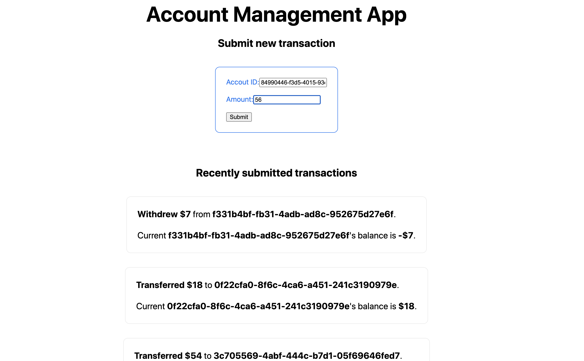

# Interview Assignment: Account Management Frontend - Level 3

👋 Hi there!

In this coding assignment, your task is to build a Frontend app that integrates with the [Account Management API](api-specification.yml) to create and read account transactions.

See the instructions below to get the idea of how it should work.

## Instructions
Here's a mockup to get the idea of how the Frontend should look.



This assignment includes a test suite. To make your Frontend app compatible with it please ensure the following (feel free to tweak the UI otherwise):

* There's a form with two input fields: Account ID and Amount. Whenever the form is submitted, a new transaction with the collected data should be created on the server. The HTML elements must have the following attributes:
  * Account ID input field: `data-type="account-id"`
  * Amount input field: `data-type="amount"`
  * Form: `data-type="transaction-form"`
* There's a list of the previously submitted transactions. Every newly submitted transaction should appear at the top of the list. The HTML element that represents a transaction should include the following HTML attributes: `data-type=transaction`, `data-account-id={transaction-account-id}`, `data-amount={transaction-amount}`, and `data-balance={current-account-balance}`
* A warning message should appear if there was an attempt to submit a duplicate transaction within 5 seconds from the original one. The message should say: `You need to wait for 5 seconds before sending a duplicate transaction.`. The transaction should not be created on the server in this case. The warning message HTML element should have the following HTML attribute: `data-type=warning-message`.

## What's included 🗂
We've added the [Account Management API](api-specification.yml) specification defined in the Open API format, a backend service that implements this API, and an automated Cypress test suite. 

To run the tests, first update the `baseUrl` (where your Frontend runs) in [cypress.json](cypress.json) and run your app.

Then to spin up the Backend and run the tests:
```shell script
yarn run start:backend # Spin up the backend
yarn run test # Run the tests
```

## What we're looking for ⭐️
- **Integrate with a REST API**. Using the provided API spec, figure out the right service endpoints to use.
- **Implement client-side form data validation**. The API has restrictions on the allowed data format. Make sure to do the required checks client-side before sending the data to the server.
- **Organize your code with components**. Extract components that help you avoid duplication, but don't break things apart needlessly. We want to see that you can implement the UI with sound HTML semantics.
- **Implement graceful handling of network failures**. Your app should provide a way for re-sending failed transactions. A transaction might fail to send due to one of the following reasons:
  - The backend is down.
  - The browser has no Internet connection.
  - The backend returns an HTTP 5xx error.
- **Document your choices**. Extend this README.md with info about how to run your application along with any hints that will help us review your submission and better understand the decisions you made. Specifically, please describe your solution for re-sending failed transactions.

## How to submit your solution 📬

1. Update the [`build:frontend`](package.json#L5) and [`start:frontend`](package.json#L6) scripts in [package.json](package.json) that respectively build and run your application. 
2. Commit and push your changes to a new branch called `implementation`. A new [GitHub Actions](https://docs.github.com/en/free-pro-team@latest/actions/quickstart) run will trigger automatically based on the [predefined pipeline](.github/workflows/tests.yml). The pipeline will run the `build:frontend` and `start:frontend` scripts from above to spin up your application and run the predefined Cypress tests against it. In case you want to troubleshoot a particular pipeline run, you can access both the video and the screenshots taken by the [upload-artifact](https://github.com/actions/upload-artifact#where-does-the-upload-go) GitHub action.
3. Make sure your latest build has succesfully passed (you should see a green checkbox in GitHub).
4. Create a Pull Request from `implementation`.

## What to expect next 👀
1. An engineer will do a code review of your Pull Request. They might ask questions that you'll need to answer, so please watch for GitHub notifications in your mailbox.
2. In the end, the engineer who did the code review will merge your Pull Request. That's when your assignment is over.

## FAQ ❓
- Q: What resources am I allowed to use?
  - A: This assignment simulates a real-world engineering task, so feel free to use any resources you'd typically use.
- Q: How much time should I spend?
  - A: Try not to spend more than 3 hours.
- Q: What if I get stuck?
  - A: Feel free to create a GitHub issue on this repository describing your problem.
  

---

Made by [DevSkills](https://devskills.co). 

How was your experience? **Give us a shout on [Twitter](https://twitter.com/DevSkillsHQ) / [LinkedIn](https://www.linkedin.com/company/devskills)**.
